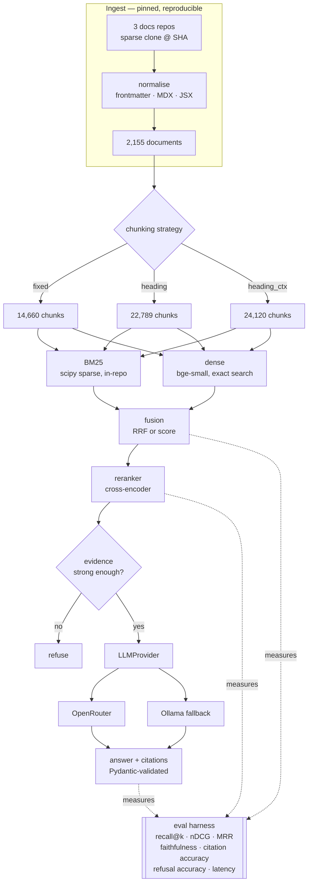

# production-rag

> Hybrid BM25 + dense retrieval over DuckDB, dbt and Dagster documentation, with
> cross-encoder reranking and cited answers — where retrieval quality is measured, not asserted.

[](https://github.com/Prithv122/production-rag/actions/workflows/ci.yml)

**Live demo:** _pending — Hugging Face Space, session 3_
**Stack:** Python 3.12 · scipy sparse (own BM25) · sentence-transformers · OpenRouter + Ollama · Gradio

> **Status: session 2 of 3 complete.** Retrieval is built, evaluated and reported: seven
> arms across three chunking strategies against a 184-question span-labelled evaluation set,
> plus a cross-encoder reranker, query rewriting as a measured arm, and a provider
> abstraction with a fallback chain. **The question set has not yet been human-verified** —
> that pass and answer generation are session 3, and the tables will be re-cut on the
> verified subset. Sections marked _pending_ are honestly empty rather than filled with
> placeholders.

---

## 1. The problem

Someone working across a modern data stack — DuckDB for compute, dbt for transformation,
Dagster for orchestration — has three separate documentation sites and no way to ask a
question that spans them. "How do dbt dependencies differ from Dagster asset
dependencies?" is answerable only by reading both sites and holding them side by side.

The engineering problem underneath is not "call an LLM with some context." It is that a
retrieval system which *looks* fine in a demo can be badly broken in ways no demo reveals,
and the only way to know is to measure it against ground truth. So this repository is
built around the measurement, and the answer generator is a swappable component at the end
of it.

## 2. The data

| | |
|---|---|
| Sources | `duckdb/duckdb-web` · `dbt-labs/docs.getdbt.com` · `dagster-io/dagster` |
| Licences | MIT · Apache-2.0 · Apache-2.0 — verified via the GitHub licence API at pin time |
| Pinned at | `6f6cd165` · `cd0e5b0e` · `76eed340` |
| Size | **2,155 documents · 12.77 M characters** after normalisation |
| Per tool | dbt 1,145 · dagster 580 · duckdb 430 |
| Refresh | One-off, by commit SHA. Re-pinning invalidates published numbers and is a deliberate act. |

Real, public, permissively licensed documentation — not a synthetic corpus. Ingested by
sparse git clone at a pinned commit rather than an HTML crawl, so the corpus is
reproducible: rebuild from the SHA and you get the bytes a number came from.

**DuckDB is restricted to `docs/current`.** The repository also ships `docs/0.10` through
`docs/1.3` plus `docs/lts` — 2,073 further files that are near-duplicates of `current`.
Indexing them would not only wreck precision, it would make ground truth ill-defined:
"which chunk answers this?" would have six equally correct answers. The superseded trees
are reachable behind a flag purely to quantify that, as an ablation. See
[NOTES.md](NOTES.md).

## 3. Architecture



## 4. Key decisions & tradeoffs

| Decision | Chose | Over | Why |
|---|---|---|---|
| Corpus ingest | Sparse git clone at a pinned SHA | HTML crawl | Markdown source has no nav chrome; the LICENSE travels with the repo; the corpus is addressable by SHA, so a published number is reproducible |
| DuckDB scope | `docs/current` only | All 7 version trees | 2,073 near-duplicate files make ground truth ill-defined, not just noisy. Quantified as an ablation rather than asserted |
| BM25 | Written in-repo over a scipy sparse matrix | `rank_bm25` | `rank_bm25` loops in Python per query; this grid runs thousands of full-corpus scans. Precomputing the weight matrix gives **0.37 ms** queries |
| Tokenizer | Identifiers emitted whole **and** split | Either alone | Whole-only misses "schema change" → `on_schema_change`; split-only destroys the exact-match recall BM25 exists for |
| Stopwords | None | Standard English stoplist | `in`, `as`, `is`, `order`, `by` are SQL keywords and real queries here. IDF discounts frequency from this corpus instead |
| Vector search | Exact, numpy | FAISS / HNSW / a vector DB | 23k × 384 = 35 MB; exact search is a matrix-vector product. ANN would add a dependency, a tuning knob and approximation error to speed up a millisecond. See §7 for where that flips |
| Encoder | `Embedder` Protocol, torch in an optional extra | Direct dependency | CI runs against a deterministic fake and never downloads ~2 GB. CI actively asserts torch is absent |
| Fusion | RRF **and** score fusion, both measured | Picking one | BM25 has a true zero floor (absent); cosine ranks everything (less similar). Which fusion handles that better is empirical |
| Chunk sizing | Characters | Tokens | A token budget drags the encoder's tokenizer — and torch — into every test |
| Agent loop | Excluded | LangGraph / tool loop | That is project 43. A repo that is simultaneously a RAG system, an agent and an eval framework demonstrates none of them |
| **Ground truth unit** | A character span in a document | A gold chunk id | Chunk ids are not shared between the three strategies. Span labels are chunked *per strategy* at scoring time, so one labelling effort yields three comparable evaluations and the labels survive a change to the chunk size |
| **Question category** | Computed from corpus document frequency | The generating model's own label | A model asked to write a conceptual question and then to say whether it did will say yes. "Does the question share a rare token with its own evidence?" is checkable; the model's opinion of itself is not |
| **Reranker** | `ms-marco-MiniLM-L-6-v2` (22M) | `bge-reranker-base` (278M) | Reranking the pool is the most repeated operation in the grid. Picking the model that scores higher on a leaderboard without pricing it is the reasoning this project exists to avoid |
| **Rewrite arms** | `expand` (original + variants) **and** `replace` | One rewrite arm | `expand` keeps the literal query in the fusion so a paraphrase can add a passage but not remove one; `replace` cannot. Running both is what turns a prediction into a measurement |
| **LLM client** | stdlib `urllib` against the OpenAI-compatible endpoint | The `openai` package | Ollama's native endpoint is a different shape, so a client library covers one of two providers and the second is hand-written anyway — for a dependency tree on the offline retrieval path |
| **Replay caches** | Exported to one JSONL each and committed | Gitignored, or a sharded directory in git | "Reproducible with the author's local cache" is not reproducible. The caches are small; the embedding cache (24k float32 vectors) is not, and stays out |

## 5. Results

### Corpus and index shape — measured

| Strategy | Chunks | Mean chars | Median | Max |
|---|---:|---:|---:|---:|
| `fixed` | 14,660 | 997 | 1,068 | 1,401 |
| `heading` | 22,789 | 536 | 467 | 1,200 |
| `heading_ctx` | 24,120 | 680 | 632 | 1,401 |

Every chunk lands within `max_chars + overlap` (1,200 + 200). Getting there took two
budget bugs — see [NOTES.md](NOTES.md).

### BM25 index — measured

| | |
|---|---|
| Chunks | 22,789 (`heading`) |
| Vocabulary | 41,599 terms |
| Nonzeros | 1,101,612 |
| Size | 4.4 MB |
| Build | 2.5 s |
| **Mean query latency** | **0.37 ms** |

### Indexes — measured, all three strategies

Encoder `BAAI/bge-small-en-v1.5`, 384 dimensions, float32, CPU. Latency is the mean of 500
queries on an idle machine.

| Strategy | Vectors | Size | Build | chunks/s | tokens/s | Dense query | BM25 query |
|---|---:|---:|---:|---:|---:|---:|---:|
| `fixed` | 14,660 | 23 MB | 40.8 min | 6.0 | 1,494 | **1.07 ms** | 0.33 ms |
| `heading` | 22,789 | 35 MB | 37.0 min | 10.3 | 1,375 | **1.68 ms** | 0.40 ms |
| `heading_ctx` | 24,120 | 37 MB | 48.9 min | 8.2 | 1,397 | **1.73 ms** | 0.51 ms |
| | | | **127 min total** | | | | |

**Why no ANN.** Both query columns are an exhaustive pass over the entire corpus — every
vector, every posting — with no index structure and no approximation. At 1–2 ms, an
approximate index would trade guaranteed recall for a saving that does not exist. §7 covers
the scale at which that flips. Latency is memory-bandwidth bound and therefore
load-sensitive: the same `fixed` index measured 1.07 ms idle and 3.43 ms while another
build saturated five cores, which is why the measurement condition is stated.

**The three rows are a natural experiment.** Same corpus, same encoder, same hardware —
chunking is the only variable, and it moves mean chunk length from 536 to 997 characters:

- per-**chunk** throughput spans 6.0 → 10.3 (**1.7×**)
- per-**token** throughput spans 1,375 → 1,494 (**8%**)

Encoder cost is set by tokens; "texts per second" is an artefact of whatever text length
you benchmarked on. This corrected an estimate of mine that was ~27× optimistic — the
original benchmark's *token* figure had been roughly right all along, only the unit was
wrong. See [NOTES.md](NOTES.md).

### A worked example — illustrative, not a metric

One real query against the built `heading` index, top 3 from each arm. The question
describes incremental models without ever using the word *incremental*, which is precisely
the case where lexical and semantic retrieval diverge:

> **"how do I avoid rebuilding the whole table on every run"**

| Arm | Top result |
|---|---|
| BM25 | *Why can't I just write DML in my transformations?* — keyword collision on "write", "table", "run". Misses. |
| Dense | *Idempotence in dbt → Full-refresh as a safety net* — adjacent, but #3 is a **billing** page. Noisy. |
| **Hybrid (RRF)** | ***Configure incremental models → Defining incremental materializations*** — correct. |

Neither arm alone puts the right page first; the fusion does. This is one anecdote, chosen
because it illustrates the mechanism — it is **not** evidence, and it is not a substitute
for the tables below. Reproduce it with:

```bash
uv run production-rag search "how do I avoid rebuilding the whole table on every run" --arm hybrid
```

### How ground truth was built

Retrieval numbers are only as good as the labels they are scored against, so the labelling
is described before the numbers rather than after.

**Gold is a character span in a document, not a chunk id.** Three chunking strategies
produce 14,660 / 22,789 / 24,120 chunks and share no ids between them, so a chunk-level
label would either make the cross-strategy comparison impossible or force three separate
labelling efforts and then compare numbers built on different labels. Each label is
`(doc_id, start, end)` anchored to a verbatim quote; every chunker already records the
span each chunk came from, so each strategy derives its own gold chunk ids by overlap at
scoring time. One labelling effort, three comparable evaluations, and the labels survive a
change to the chunk size. Coverage — the share of questions whose evidence a given
strategy's chunks actually carry — is reported with the results, because a strategy that
fails to map some evidence is being scored on a different question set.

**Questions come from three places, and the weakest source is guarded hardest.**

| Source | What it produces | Guard |
|---|---|---|
| LLM, from a sampled passage | The bulk. Passages stratified by tool, so the set is not 53% dbt like the corpus | Claimed quote must locate verbatim in the real document; context-dependent phrasings ("in the passage above") and near-duplicates rejected. Every rejection is counted |
| Hand-written, cross-tool | Questions whose answer needs two tools at once — the case the hybrid arm is supposed to earn its keep on | Quotes resolved at load time; a quote that no longer locates raises rather than silently shrinking the bucket |
| Hand-written, unanswerable | No evidence anywhere in the corpus, including two *near misses* using entirely in-domain vocabulary | Scored separately: recall over an empty gold set is undefined |

**The category is computed, not claimed.** Whether a question counts as
*exact-terminology* or *conceptual* is decided by corpus document frequency — does it share
a token with its own evidence that appears in ≤50 of ~23,000 chunks? — rather than by the
label the generating model attached to its own output. A model asked to write a conceptual
question and then to say whether it did will say yes.

**A human verifies a sample.** Nothing above establishes that a question is sensible or
that its labelled passage is really the best evidence; only someone who knows the tools can
say that. `production-rag verify` walks the set and records accept / edit / reject with the
correction rate.

**Result of that pass: 60 of 184 questions reviewed, 60 accepted, 0 edited, 0 rejected — a
correction rate of 0/60.** That number is reported as it came out, and it deserves more
scepticism than a bad one would. Three things about it are worth stating plainly:

- The screening in front of the human pass is not weak. 63 of 237 proposals were already
  discarded automatically — 43 for a quote that does not appear in its source document, 20
  for being too short. The questions reaching a reviewer are the ones that already survived
  a verbatim-quote check, so a low correction rate is the expected outcome, not a surprising
  one. It is evidence that the *screen* works, not that the questions are perfect.
- A 0/60 rate cannot distinguish "the set is clean" from "the reviewer accepted too
  readily". The interface makes accept the cheapest key, which is exactly the wrong default
  for a measurement, and 124 questions remain unreviewed.
- **The reviewed 60 were the first 60 in file order, which is not a random sample.** Their
  scores sit at or below the lower edge of the resampling band for a 60-question subset
  (table below) — consistently low rather than central. `verify` now walks the pending set
  in seeded-shuffled order so that a partially-verified set is a random sample of the whole
  one; the prefix bias in the first 60 cannot be undone retroactively and is disclosed
  instead.

### Retrieval quality — measured

184 questions (174 LLM-proposed and screened, 10 hand-written), `k = 10`, candidate pool 50,
scored against document-span labels resolved per strategy. Evidence maps onto 100% / 99.4% /
99.4% of questions for `fixed` / `heading` / `heading_ctx`, so the three columns are scored
on the same set.

> **Read the caveats before the numbers.** 60 of the 184 questions have been human-verified
> (0 corrections); the other 124 have not. The re-cut on the verified subset is below and it
> changes no conclusion. And the bulk of the set was written by a model *from a passage it
> had just read*, which structurally flatters lexical retrieval: the question tends to reuse
> vocabulary the passage contains. That bias inflates the BM25 column specifically. The
> `conceptual` split, where the generator was instructed to avoid the passage's distinctive
> terms, is the more trustworthy comparison, and the hand-written cross-tool questions are
> the least contaminated of all.

**recall@5**

| Arm | fixed | heading | heading_ctx |
|---|---:|---:|---:|
| `bm25` | 0.697 | 0.695 | 0.666 |
| `dense` | 0.485 | 0.555 | 0.531 |
| `hybrid` (RRF) | 0.659 | 0.688 | 0.645 |
| `hybrid_score` | 0.697 | 0.703 | 0.679 |
| `hybrid_weighted` (RRF, lexical ×2) | 0.667 | 0.689 | 0.639 |
| **`hybrid_score_weighted`** | **0.716** | 0.706 | 0.684 |

**nDCG@10**

| Arm | fixed | heading | heading_ctx |
|---|---:|---:|---:|
| `bm25` | 0.619 | 0.631 | 0.635 |
| `dense` | 0.435 | 0.499 | 0.450 |
| `hybrid` (RRF) | 0.578 | 0.602 | 0.576 |
| `hybrid_score` | 0.612 | 0.628 | 0.606 |
| `hybrid_weighted` | 0.588 | 0.619 | 0.598 |
| **`hybrid_score_weighted`** | 0.633 | **0.658** | 0.632 |

#### Four results I did not expect to have to write

**1. Plain RRF hybrid is worse than BM25 alone.** 0.688 vs 0.695 recall@5 on `heading`, and
0.602 vs 0.631 nDCG@10 — the default hybrid configuration, the one most RAG tutorials ship,
*loses* to the lexical arm on its own. The mechanism is visible in the fusion: unweighted RRF
gives the dense arm exactly as many votes as the lexical one, and the dense arm is 14 points
of recall worse here. It does not add signal, it dilutes it. "Hybrid beats single-arm" is a
claim about a corpus, not a law.

**2. Score fusion beats RRF everywhere**, on every strategy and both metrics. Session 1
implemented both rather than picking one, on the grounds that BM25's true-zero floor and
cosine's rank-everything behaviour interact with fusion in a way that is empirical rather
than obvious. Discarding the scores costs about 2.5 nDCG points here.

**3. Weighting the lexical arm ×2 is what actually makes hybrid worth running.**
`hybrid_score_weighted` is the only arm that clearly beats BM25 alone on both metrics
(0.706 / 0.658 vs 0.695 / 0.631 on `heading`). Weighting rescues score fusion; it improves
RRF without rescuing it (0.619 nDCG, still under BM25). A single 2× weight — one number,
one line of config — is worth more than the entire dense arm was on its own.

**4. `heading_ctx` is worse than `heading`.** Prefixing the heading breadcrumb onto the
embedded text is the one thing that arm exists to test, and it costs 2–4 points of recall on
every arm. The breadcrumb is mostly repeated boilerplate across a page's sections, so it adds
near-identical text to every chunk of a document — which is exactly the wrong thing to do to
a bag-of-terms index and to a similarity search alike. `heading` wins nDCG and `fixed` edges
recall@5; `heading` is the default.

#### The split the pooled mean hides

recall@5 on `heading`, by question category:

| Arm | exact_term (n=53) | conceptual (n=121) | cross_tool (n=4) |
|---|---:|---:|---:|
| `bm25` | **0.933** | 0.616 | 0.000 |
| `dense` | 0.712 | 0.506 | 0.000 |
| `hybrid` (RRF) | 0.913 | 0.614 | 0.000 |
| `hybrid_score` | 0.904 | **0.640** | 0.000 |
| `hybrid_weighted` | **0.933** | 0.607 | 0.000 |
| `hybrid_score_weighted` | **0.933** | 0.632 | 0.000 |

BM25 alone is unbeatable on exact-terminology questions — nothing improves on 0.933, and
three arms merely tie it. On conceptual questions the ordering inverts and *unweighted* score
fusion wins, because that is the regime where the dense arm's opinion is worth having and
weighting it down throws away the thing that helps. A single pooled number over this set
would report whichever category the set happens to contain more of, and I chose that mix.

**Cross-tool questions score 0.000 for every arm.** These are the four hand-written questions
whose answer genuinely requires two tools' documentation at once, and recall counts a
question as fully answered only when *both* spans are retrieved. I checked the labels rather
than assuming: issuing the gold quote itself as a query returns its chunk at **rank 1**, so
the labels are correct and reachable — the questions are simply beyond every arm here. The
best BM25 rank for any gold chunk was 183 on one question and outside the top 500 on another.
n = 4, so this is a signal to build more of them, not a measurement.

#### The re-cut on the human-verified subset — measured

The point of a verification pass is to find out whether the conclusions survive it. Restricted
to the 60 verified questions (`eval --replay --verified-only`, `heading`):

| Arm | recall@5, all 184 | recall@5, verified 60 | nDCG@10, all 184 | nDCG@10, verified 60 |
|---|---:|---:|---:|---:|
| `bm25` | 0.695 | 0.617 | 0.631 | 0.538 |
| `dense` | 0.555 | 0.483 | 0.499 | 0.438 |
| `hybrid` (RRF) | 0.688 | 0.600 | 0.602 | 0.530 |
| `hybrid_score` | 0.703 | 0.650 | 0.628 | 0.547 |
| `hybrid_weighted` | 0.689 | 0.600 | 0.619 | 0.531 |
| **`hybrid_score_weighted`** | **0.706** | **0.650** | **0.658** | **0.586** |

**Every number falls, and every conclusion holds.** `hybrid_score_weighted` still wins both
metrics; unweighted RRF hybrid is still below BM25 alone on nDCG (0.530 vs 0.538); score
fusion still beats rank fusion; `heading` still beats `heading_ctx`. The ordering is what the
project claims and the ordering is unchanged.

The uniform 5–9 point drop is **not** a correction — the correction rate was 0/60, so these
are the same questions with the same labels. It is a sample effect, and the honest way to
size it is to resample (`production-rag band -n 60`, 20,000 draws of 60 questions from the
177 answerable ones, without replacement):

| Arm | full set | 95% band for any 60 | verified 60 |
|---|---:|---:|---:|
| `bm25` recall@5 | 0.695 | [0.600, 0.792] | 0.617 |
| `hybrid_score_weighted` recall@5 | 0.706 | [0.617, 0.800] | 0.650 |
| `bm25` nDCG@10 | 0.631 | [0.545, 0.718] | 0.538 |
| `hybrid_score_weighted` nDCG@10 | 0.658 | [0.571, 0.745] | 0.586 |

Three of the four land inside the band and near its lower edge; `bm25` nDCG@10 falls just
below it.

So the verified 60 are a *hard* slice, not a corrected one — which is exactly what you would
expect from an ordered prefix rather than a random sample, and is why `verify` now shuffles
(see above). **A 60-question subset moves a headline recall figure by ±0.10 at 95%.** That is
the real precision of every number in this README, and it is larger than most of the gaps the
tables are being used to argue about. The arm ordering is robust; the third decimal place is
decorative.

### Reranking and query rewriting — measured on `heading`

Run on the single winning strategy rather than all three: the cross-encoder is CPU-bound at a
measured **7.45 pairs/s** on this machine, so the full grid is hours of compute for a
comparison that is orthogonal to chunking. Stating the reason beats quietly dropping rows.

| Arm | recall@5 | nDCG@10 | MRR | wall clock |
|---|---:|---:|---:|---:|
| `hybrid` (RRF, no rerank) | 0.688 | 0.602 | 0.561 | 7 s |
| `hybrid_score_weighted` (best first-stage) | 0.706 | 0.658 | — | 9 s |
| `hybrid_rerank` | 0.713 | 0.662 | 0.629 | 781 s |
| **`rerank_rewrite`** (expand) | **0.730** | **0.665** | **0.630** | 271 s |
| `rerank_rewrite_only` (replace) | 0.685 | 0.622 | 0.595 | 226 s |

**The cross-encoder earns its cost, and the cost is the whole story.** Reranking lifts the
RRF hybrid by 6 nDCG points (0.602 → 0.662) — the largest single improvement in the project.
It also takes **110× longer** than the arm it improves, and gets almost all the way there
without a second stage at all: `hybrid_score_weighted`, which is one weight and one fusion
choice, reaches 0.658 nDCG in 9 seconds. The reranker's remaining margin over it is
**0.004 nDCG for 87× the latency**. On this corpus, at this scale, tuning the fusion is the
better engineering decision and the cross-encoder is the thing you add when you have already
done that and need the last half-point.

(The rewrite arms' wall clock is lower than `hybrid_rerank`'s only because they ran second
and reused its cached cross-encoder scores. Rewrite latency here is a cache read; the real
per-call figure is a **median 65 s** on the free tier, and it is in the cached responses.)

#### The pre-registered prediction was half right, and the half that was wrong is more useful

Recorded in session 1, before any of this ran: *query rewriting will hurt exact-terminology
queries — paraphrasing destroys the literal token BM25 matches on — and help conceptual and
cross-tool ones.*

recall@5 on `heading`, by category:

| Arm | exact_term (n=53) | conceptual (n=121) | cross_tool (n=4) |
|---|---:|---:|---:|
| `hybrid_rerank` (no rewrite) | 0.894 | 0.659 | 0.000 |
| `rerank_rewrite` (expand) | 0.894 | **0.684** | 0.000 |
| `rerank_rewrite_only` (replace) | **0.913** | 0.605 | **0.125** |

**Right about `expand`.** Keeping the original query in the fusion leaves exact-terminology
questions exactly where they were (0.894 → 0.894) and adds 2.5 points on conceptual ones
(0.659 → 0.684). A variant can add a passage; it cannot remove the literal match. That is
what the arm was designed to do and it did it.

**Wrong about `replace`, and wrong in a specific way.** Retrieving with the rewrite *instead
of* the original was supposed to be where paraphrase damage showed up on exact-terminology
queries. It went the other way: 0.894 → **0.913**, the best exact-terminology score of any
arm in the project. The explanation is in the prompt — it forbids paraphrasing identifiers,
so the model keeps `on_schema_change` verbatim and discards the surrounding filler
("how do I", "is there a way to"). The result is a query that is *more* concentrated on the
rare token BM25 keys on. The instruction that was written to make the comparison fair turned
out to be the mechanism.

The damage landed somewhere else entirely: **conceptual questions lost 5.4 points**
(0.659 → 0.605). Replacing a user's own phrasing with one model guess throws away the
diversity that `expand`'s fusion provides — and conceptual queries are exactly where a single
guess is most likely to be the wrong guess.

**And `replace` is the only arm that ever scored on cross-tool questions** (0.125 — one of
four questions retrieving one of its two required spans). n = 4, so it is a hint rather than
a result, but it is the plausible direction: a question spanning two tools needs its
vocabulary moved, not preserved.

The honest conclusion is therefore not "rewriting improves retrieval" and not "rewriting
hurts exact-terminology queries" either. It is: **expand, don't replace — unless the query
is conceptual or cross-tool, where replacing is the only thing that moved the needle.** A
pooled mean over this set would have reported `expand` as a 1.7-point win and buried
everything above.

### Answer quality — _pending, session 3_

Faithfulness, citation correctness, refusal accuracy, JSON parse rate, latency and cost,
across `nemotron-3-super:free`, `nemotron-3-ultra:free`, `gemini-2.5-flash-lite` and local
Ollama, all reading the **same frozen retrieved chunks** so only generation varies.

## 6. How to run

```bash
git clone https://github.com/Prithv122/production-rag.git
cd production-rag
uv sync
uv run pytest
```

That runs the full test suite with no API key, no network and no torch.

To build the corpus and indexes (needs the network once, and the embedding model):

```bash
uv sync --extra embed
uv run production-rag ingest
uv run production-rag index
uv run production-rag stats
```

Then query it:

```bash
uv run production-rag search "how do I make a dbt model incremental" --arm hybrid
```

`--arm` takes `bm25`, `dense`, `hybrid`, `hybrid_score`, `hybrid_rerank`, `rerank_rewrite`
or `rerank_rewrite_only`; `--strategy` takes `fixed`, `heading` or `heading_ctx`;
`--fusion` takes `rrf` or `score`. The lexical arm alone needs no embedding model:

```bash
uv run production-rag index --no-dense --strategy heading
uv run production-rag search "on_schema_change" --arm bm25
```

### Reproducing the evaluation

Every published retrieval number replays with no API key and no network, because the LLM
and cross-encoder responses ship with the repository:

```bash
uv run production-rag cache import
uv run production-rag eval --replay --verified-only
```

`--replay` turns a cache miss into an error rather than a live call, so a number that
cannot be reproduced offline cannot quietly appear in this README. Regenerating the eval
set from scratch — which *does* need `OPENROUTER_API_KEY` (see [.env.example](.env.example))
and takes a couple of hours on the free tier — is:

```bash
uv run production-rag propose --passages 120     # LLM question candidates
uv run production-rag verify --limit 60          # the human pass
uv run production-rag eval                       # the grid
uv run production-rag cache export               # re-bundle for replay
```

## 7. What I'd change at 100× scale

**Exact search breaks first, and not where it looks.** At 100× (~2.4 M chunks) the vector
matrix is ~3.5 GB — still loadable, but a full pass moves 3.5 GB through memory per query,
so latency goes from sub-millisecond to hundreds of milliseconds and memory bandwidth,
not compute, becomes the wall. That is the point to introduce HNSW, and the honest
consequence is accepting recall below 1.0 in exchange — which should be *measured* against
the exact baseline this repo already has, since the exact result is the ground truth ANN
gets compared to.

**BM25's weight matrix stops fitting the rebuild model.** 1.1 M nonzeros becomes ~110 M;
build time goes from 2.5 s to minutes, and the whole-index rebuild this project does on
every ingest becomes untenable. The fix is incremental indexing with per-segment IDF, which
means IDF is no longer global and scores stop being comparable across segments — a real
correctness problem, not just an engineering one.

**Corpus versioning stops being avoidable.** The `docs/current`-only decision works because
there is one current version. At 100× the corpus spans versions that users legitimately ask
about, so version becomes a retrieval *filter* and part of the query, not something to
exclude at ingest.

**The eval set becomes the bottleneck.** 75 hand-verified questions do not characterise a
2.4 M-chunk corpus. Ground truth would have to come from production query logs with
click/thumbs feedback, which changes the metric from recall@k against gold chunks to
counterfactual estimation from logged interactions — a different discipline.

---

## References

- Okapi BM25 — Robertson & Zaragoza, *The Probabilistic Relevance Framework: BM25 and Beyond* (2009).
- Reciprocal rank fusion — Cormack, Clarke & Buettcher, *Reciprocal Rank Fusion Outperforms Condorcet and Individual Rank Learning Methods* (SIGIR 2009).
- `BAAI/bge-small-en-v1.5` for embeddings; the asymmetric query-side instruction prefix follows the model card.

Corpus content belongs to its respective projects under the licences recorded in §2 and is
not redistributed by this repository — it is fetched at build time from the pinned commits.
