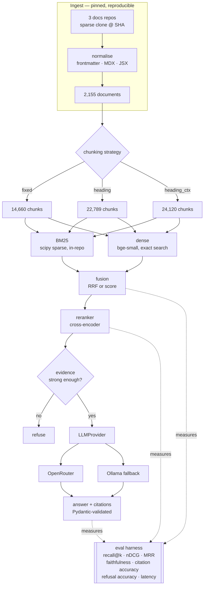

# production-rag

> Hybrid BM25 + dense retrieval over DuckDB, dbt and Dagster documentation, with
> cross-encoder reranking and cited answers — where retrieval quality is measured, not asserted.

[](https://github.com/Prithv122/production-rag/actions/workflows/ci.yml)

**Live demo:** _pending — Hugging Face Space, session 3_
**Stack:** Python 3.12 · scipy sparse (own BM25) · sentence-transformers · OpenRouter + Ollama · Gradio

> **Status: session 1 of 3 complete.** Ingest, chunking, BM25, dense retrieval, fusion and
> the metric definitions are built and tested. Retrieval result tables land in session 2,
> once ground truth exists; generation and the deployed demo in session 3. Sections marked
> _pending_ are honestly empty rather than filled with placeholders.

---

## 1. The problem

Someone working across a modern data stack — DuckDB for compute, dbt for transformation,
Dagster for orchestration — has three separate documentation sites and no way to ask a
question that spans them. "How do dbt dependencies differ from Dagster asset
dependencies?" is answerable only by reading both sites and holding them side by side.

The engineering problem underneath is not "call an LLM with some context." It is that a
retrieval system which *looks* fine in a demo can be badly broken in ways no demo reveals,
and the only way to know is to measure it against ground truth. So this repository is
built around the measurement, and the answer generator is a swappable component at the end
of it.

## 2. The data

| | |
|---|---|
| Sources | `duckdb/duckdb-web` · `dbt-labs/docs.getdbt.com` · `dagster-io/dagster` |
| Licences | MIT · Apache-2.0 · Apache-2.0 — verified via the GitHub licence API at pin time |
| Pinned at | `6f6cd165` · `cd0e5b0e` · `76eed340` |
| Size | **2,155 documents · 12.77 M characters** after normalisation |
| Per tool | dbt 1,145 · dagster 580 · duckdb 430 |
| Refresh | One-off, by commit SHA. Re-pinning invalidates published numbers and is a deliberate act. |

Real, public, permissively licensed documentation — not a synthetic corpus. Ingested by
sparse git clone at a pinned commit rather than an HTML crawl, so the corpus is
reproducible: rebuild from the SHA and you get the bytes a number came from.

**DuckDB is restricted to `docs/current`.** The repository also ships `docs/0.10` through
`docs/1.3` plus `docs/lts` — 2,073 further files that are near-duplicates of `current`.
Indexing them would not only wreck precision, it would make ground truth ill-defined:
"which chunk answers this?" would have six equally correct answers. The superseded trees
are reachable behind a flag purely to quantify that, as an ablation. See
[NOTES.md](NOTES.md).

## 3. Architecture



## 4. Key decisions & tradeoffs

| Decision | Chose | Over | Why |
|---|---|---|---|
| Corpus ingest | Sparse git clone at a pinned SHA | HTML crawl | Markdown source has no nav chrome; the LICENSE travels with the repo; the corpus is addressable by SHA, so a published number is reproducible |
| DuckDB scope | `docs/current` only | All 7 version trees | 2,073 near-duplicate files make ground truth ill-defined, not just noisy. Quantified as an ablation rather than asserted |
| BM25 | Written in-repo over a scipy sparse matrix | `rank_bm25` | `rank_bm25` loops in Python per query; this grid runs thousands of full-corpus scans. Precomputing the weight matrix gives **0.37 ms** queries |
| Tokenizer | Identifiers emitted whole **and** split | Either alone | Whole-only misses "schema change" → `on_schema_change`; split-only destroys the exact-match recall BM25 exists for |
| Stopwords | None | Standard English stoplist | `in`, `as`, `is`, `order`, `by` are SQL keywords and real queries here. IDF discounts frequency from this corpus instead |
| Vector search | Exact, numpy | FAISS / HNSW / a vector DB | 23k × 384 = 35 MB; exact search is a matrix-vector product. ANN would add a dependency, a tuning knob and approximation error to speed up a millisecond. See §7 for where that flips |
| Encoder | `Embedder` Protocol, torch in an optional extra | Direct dependency | CI runs against a deterministic fake and never downloads ~2 GB. CI actively asserts torch is absent |
| Fusion | RRF **and** score fusion, both measured | Picking one | BM25 has a true zero floor (absent); cosine ranks everything (less similar). Which fusion handles that better is empirical |
| Chunk sizing | Characters | Tokens | A token budget drags the encoder's tokenizer — and torch — into every test |
| Agent loop | Excluded | LangGraph / tool loop | That is project 43. A repo that is simultaneously a RAG system, an agent and an eval framework demonstrates none of them |

## 5. Results

### Corpus and index shape — measured

| Strategy | Chunks | Mean chars | Median | Max |
|---|---:|---:|---:|---:|
| `fixed` | 14,660 | 997 | 1,068 | 1,401 |
| `heading` | 22,789 | 536 | 467 | 1,200 |
| `heading_ctx` | 24,120 | 680 | 632 | 1,401 |

Every chunk lands within `max_chars + overlap` (1,200 + 200). Getting there took two
budget bugs — see [NOTES.md](NOTES.md).

### BM25 index — measured

| | |
|---|---|
| Chunks | 22,789 (`heading`) |
| Vocabulary | 41,599 terms |
| Nonzeros | 1,101,612 |
| Size | 4.4 MB |
| Build | 2.5 s |
| **Mean query latency** | **0.37 ms** |

### Dense index — measured

Encoder `BAAI/bge-small-en-v1.5`, 384 dimensions, float32, CPU.

| Strategy | Vectors | Size | Build | chunks/s | tokens/s | Exact query |
|---|---:|---:|---:|---:|---:|---:|
| `fixed` | 14,660 | 23 MB | ~41 min | 6.0 | 1,486 | **2.38 ms** |
| `heading` | 22,789 | 35 MB | ~37 min | 10.3 | 1,377 | 4.78 ms |

Query latency is an exhaustive scan of every vector — no approximation, no index
structure. That is the number behind the no-ANN decision in §4: full-corpus exact search
costs single-digit milliseconds, so an approximate index would trade recall for a saving
that does not exist at this scale. Latency is memory-bandwidth bound and therefore
sensitive to load; the `fixed` figure moved 2.38 → 3.43 ms while another build was
saturating five cores, so these are idle-machine measurements.

The two rows are also a natural experiment worth reading: same corpus, same encoder,
chunking as the only difference. Per-*chunk* throughput differs by 1.7×; per-*token*
throughput differs by 8%. Encoder cost is set by tokens, and "texts per second" is an
artefact of the text length you benchmarked on. See [NOTES.md](NOTES.md) — this corrected
an estimate of mine that was ~27× optimistic.

### Retrieval quality — _pending, session 2_

Requires ground truth: ~200 LLM-proposed question→gold-chunk pairs, ~60 of them
hand-verified by the author with the correction rate reported, plus ~15 hand-written
cross-tool and unanswerable questions. Arms to be reported (BM25 · dense · hybrid ·
hybrid+rerank · hybrid+rerank+rewrite) × 3 chunking strategies, **broken down by question
category** rather than pooled.

Recorded in advance, to be checked against the measurement: query rewriting is expected to
*hurt* exact-terminology queries — paraphrasing destroys the literal token BM25 matches on
— and help conceptual and cross-tool ones. If so the conclusion is "rewrite conditionally",
not "rewriting improves retrieval."

### Answer quality — _pending, session 2_

Faithfulness, citation correctness, refusal accuracy, JSON parse rate, latency and cost,
across `nemotron-3-super:free`, `nemotron-3-ultra:free`, `gemini-2.5-flash-lite` and local
Ollama, all reading the **same frozen retrieved chunks** so only generation varies.

## 6. How to run

```bash
git clone https://github.com/Prithv122/production-rag.git
cd production-rag
uv sync
uv run pytest
```

That runs the full test suite with no API key, no network and no torch.

To build the corpus and indexes (needs the network once, and the embedding model):

```bash
uv sync --extra embed
uv run production-rag ingest
uv run production-rag index
uv run production-rag stats
```

Then query it:

```bash
uv run production-rag search "how do I make a dbt model incremental" --arm hybrid
```

`--arm` takes `bm25`, `dense` or `hybrid`; `--strategy` takes `fixed`, `heading` or
`heading_ctx`; `--fusion` takes `rrf` or `score`. The lexical arm alone needs no
embedding model:

```bash
uv run production-rag index --no-dense --strategy heading
uv run production-rag search "on_schema_change" --arm bm25
```

Generation (session 2) will require `OPENROUTER_API_KEY` in `.env` — see
[.env.example](.env.example). Retrieval requires no secret at all.

## 7. What I'd change at 100× scale

**Exact search breaks first, and not where it looks.** At 100× (~2.4 M chunks) the vector
matrix is ~3.5 GB — still loadable, but a full pass moves 3.5 GB through memory per query,
so latency goes from sub-millisecond to hundreds of milliseconds and memory bandwidth,
not compute, becomes the wall. That is the point to introduce HNSW, and the honest
consequence is accepting recall below 1.0 in exchange — which should be *measured* against
the exact baseline this repo already has, since the exact result is the ground truth ANN
gets compared to.

**BM25's weight matrix stops fitting the rebuild model.** 1.1 M nonzeros becomes ~110 M;
build time goes from 2.5 s to minutes, and the whole-index rebuild this project does on
every ingest becomes untenable. The fix is incremental indexing with per-segment IDF, which
means IDF is no longer global and scores stop being comparable across segments — a real
correctness problem, not just an engineering one.

**Corpus versioning stops being avoidable.** The `docs/current`-only decision works because
there is one current version. At 100× the corpus spans versions that users legitimately ask
about, so version becomes a retrieval *filter* and part of the query, not something to
exclude at ingest.

**The eval set becomes the bottleneck.** 75 hand-verified questions do not characterise a
2.4 M-chunk corpus. Ground truth would have to come from production query logs with
click/thumbs feedback, which changes the metric from recall@k against gold chunks to
counterfactual estimation from logged interactions — a different discipline.

---

## References

- Okapi BM25 — Robertson & Zaragoza, *The Probabilistic Relevance Framework: BM25 and Beyond* (2009).
- Reciprocal rank fusion — Cormack, Clarke & Buettcher, *Reciprocal Rank Fusion Outperforms Condorcet and Individual Rank Learning Methods* (SIGIR 2009).
- `BAAI/bge-small-en-v1.5` for embeddings; the asymmetric query-side instruction prefix follows the model card.

Corpus content belongs to its respective projects under the licences recorded in §2 and is
not redistributed by this repository — it is fetched at build time from the pinned commits.
